**项目简介：**  
本项目基于主流的前后端分离架构，采用 **SpringBoot + Vue 技术栈**，配套 **MySQL 数据库**，适用于毕业设计与课题实训开发。  
本人已整理了超 **4000 多套毕业设计源码+论文+开题报告+PPT...**，涵盖 **Java、SpringBoot、Vue、SSM、uni-app 小程序、PHP、Android** 等方向，支持功能修改定制与论文服务。  
**团队提供以下服务：**  
- 项目代码修改与调试  
- 数据库配置与远程协助  
- 论文定制与修改  
**获取更多的4000多套源码或SQL文件请联系：**  
- QQ：3906443360 微信：BesheHelp

# springboot011基于springboot的课程作业管理系统

5.1管理员功能模块

管理员登录，通过填写注册时输入的用户名、密码、角色进行登录，如图5-1所示。

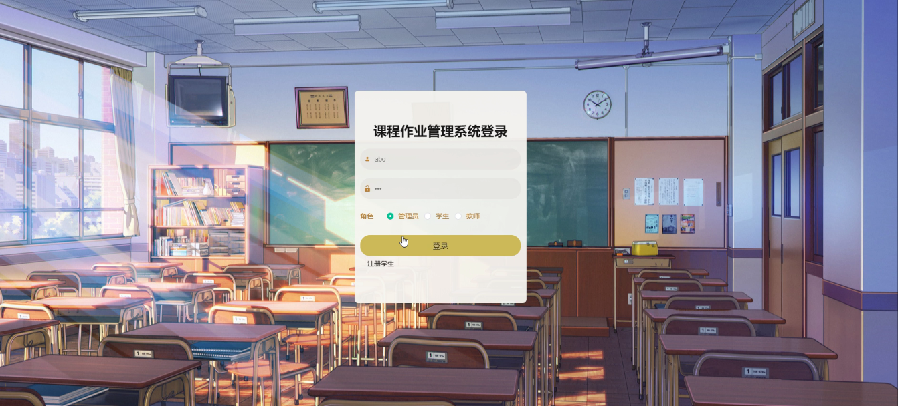

图5-1管理员登录界面图

管理员登录进入课程作业管理系统可以查看首页、个人中心、公告信息管理、班级管理、学生管理、教师管理、课程类型管理、课程信息管理、学生选课管理、作业布置管理、作业提交管理、作业评分管理、课程评价管理、课程资源管理等信息。

学生管理，在学生管理页面中可以通过填写学号、密码、学生姓名、性别、头像、手机、邮箱、班级等信息进行详情、修改，如图5-2所示。还可以根据需要对教师管理进行详情，修改或删除等详细操作，如图5-3所示。

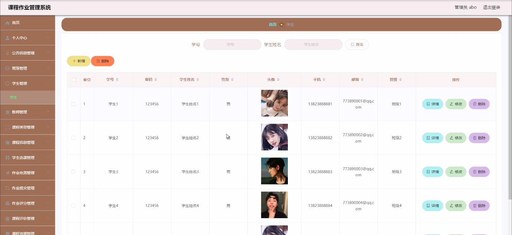

图5-2学生管理界面图

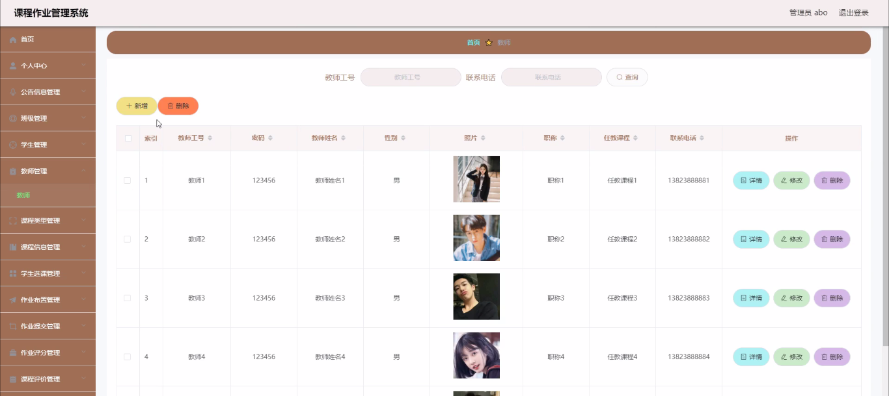

图5-3教师管理界面图

课程信息管理，在课程信息管理页面中可以查看课程名称、课程类型、班级、学期、星期、上课时间、教师工号、教师姓名等信息，并可根据需要对课程信息管理进行详情、修改或删除等操作，如图5-4所示。

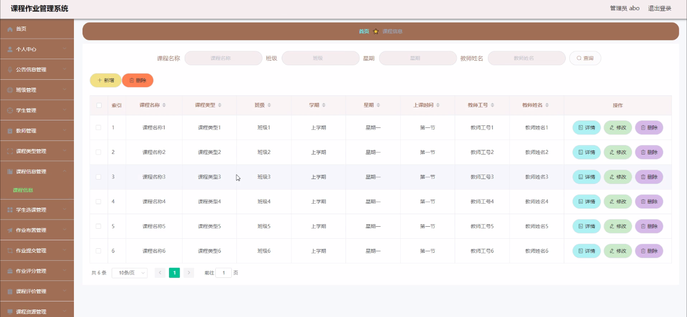

图5-4课程信息管理界面图

作业布置管理，在作业布置管理页面中可以查看课程名称、学期、班级、作业要求、发布日期、教师工号、教师姓名、学号、学生姓名等信息，并可根据需要对作业布置管理进行详情、修改或删除等详细操作，如图5-5所示。

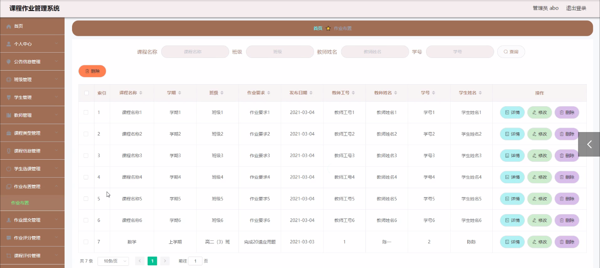

图5-5作业布置管理界面图

作业提交管理，在作业提交管理页面中可以查看课程名称、学期、班级、作业、提交日期、教师工号、教师姓名、学号、学生姓名、审核回复、审核状态等内容，并且根据需要对作业提交管理进行详情，修改或删除等详细操作，如图5-6所示。

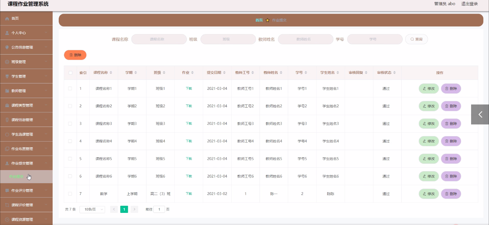

图5-6作业提交管理界面图

课程评价管理，在课程评价管理页面中可以查看课程名称、课程类型、班级、学期、评分、课程评价、评价日期、教师工号、学号、学生姓名、审核回复、审核状态等内容，并且根据需要对课程评价管理进行详情，修改或删除等详细操作，如图5-7所示。

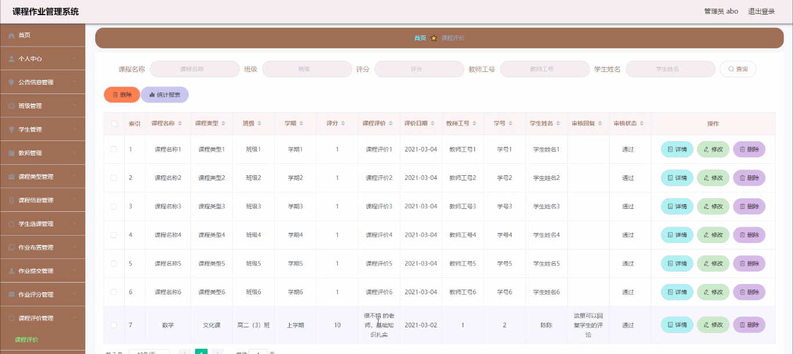

图5-7课程评价管理界面图

5.2教师功能模块

教师登录进入课程作业管理系统可以查看首页、个人中心、课程信息管理、学生选课管理、作业布置管理、作业提交管理、作业评分管理、课程评价管理、课程资源管理等内容。

作业布置管理，在作业布置管理页面中通过填写课程名称、学期、班级、作业要求、发布日期、教师工号、教师姓名、学号、学生姓名等信息还可以根据需要对作业布置管理进行修改，如图5-8所示。

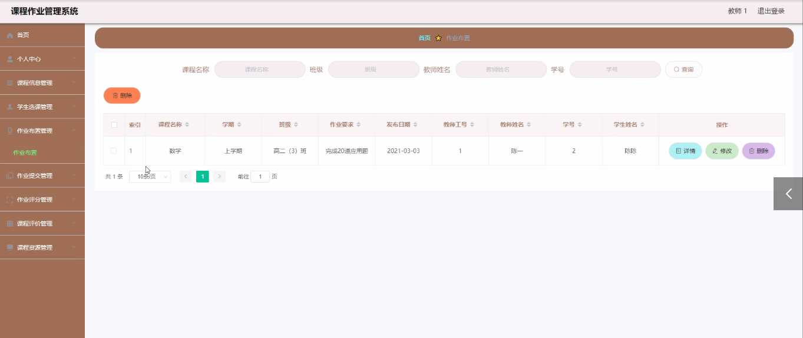

图5-8作业布置管理界面图

作业提交管理，在作业提交管理页面中可以查看课程名称、学期、班级、作业、提交日期、教师工号、教师姓名、学号、学生姓名、审核回复、审核状态等信息内容，并且根据需要对作业提交管理进行修改或删除等其他详细操作，如图5-9所示。

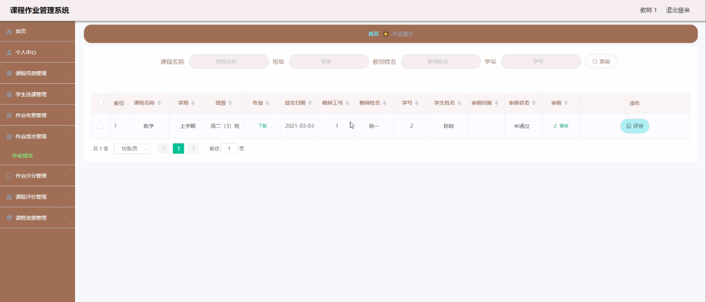

图5-9作业提交管理界面图

课程评价管理，在课程评价管理页面中通过填写课程名称、课程类型、班级、学期、评分、课程评价、评价日期、教师工号、学号、学生姓名、审核回复、审核状态等内容进行详情、删除，如图5-10所示。

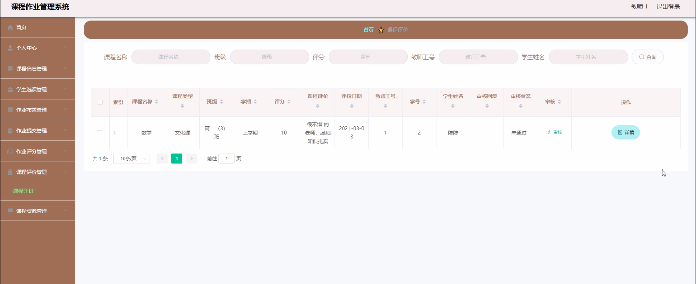

图5-10课程评价管理界面图

5.3学生功能模块

学生登录进入课程作业管理系统可以查看首页、个人中心、公告信息管理、课程信息管理、学生选课管理、作业布置管理、作业提交管理、作业评分管理、课程评价管理、课程资源管理等内容。

个人信息，在个人信息页面中通过填写学号、密码、学生姓名、性别、头像、手机、邮箱、班级等信息还可以根据需要对个人信息进行修改，如图5-11所示。

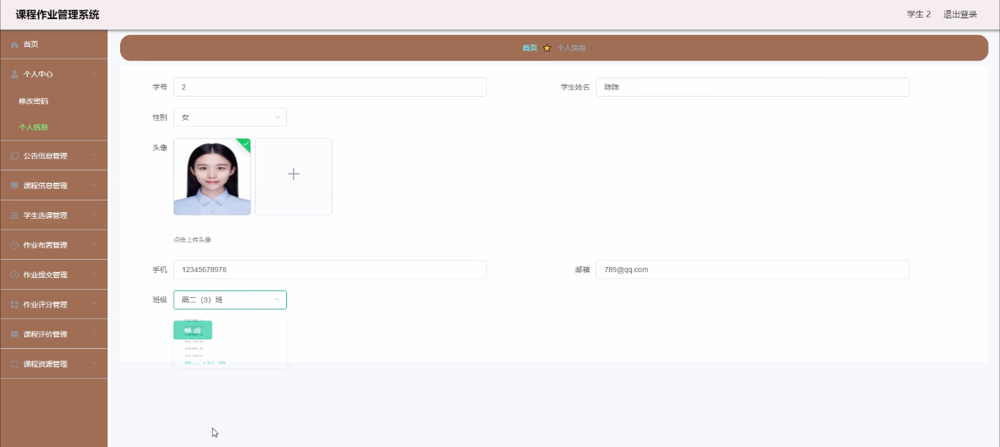

图5-11个人信息界面图

课程信息管理，在课程信息管理页面中可以查看课程名称、课程类型、班级、学期、星期、上课时间、教师工号、教师姓名等信息内容，并且根据需要对课程信息管理进行修改或删除等其他详细操作，如图5-12所示。

图5-12课程信息管理界面图

课程评价管理，在课程评价管理页面中通过填写课程名称、课程类型、班级、学期、评分、课程评价、评价日期、教师工号、学号、学生姓名、审核回复、审核状态等内容进行详情、删除，如图5-13所示。

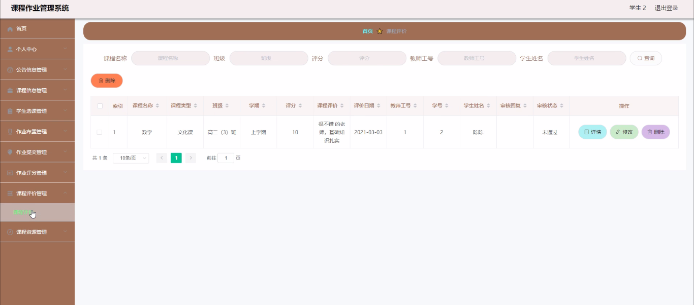

图5-13课程评价管理界面图

课程资源管理，在课程资源管理页面中通过填写课程名称、学期、附件、上传日期、教师工号、教师姓名、学号、学生姓名等内容进行详情、删除，如图5-14所示。

图5-14课程资源管理界面图